# Project Description

## Roadmap
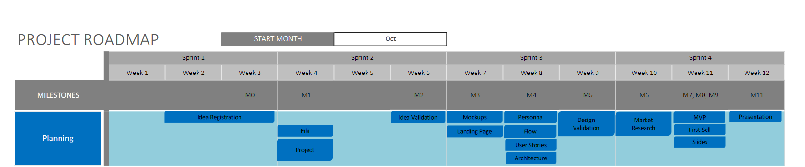

## The Team

## The Problem
Video games are starting to feel stale nowadays. There can be no doubt that the entertainment industry could always benefit from innovative ideas and new twists on classic designs. We believe that the genre that benefits the most from virtual reality is horror. The extra immersion gained from a complete field of view serves to communicate fear and tension in a much more visceral way.

## Value Proposition
By choosing to play our games, you have the get to experience a whole new reality. You move past the limits of the plastic frames around your screen and have the opportunity to truly interact with your environment and experience a character's story first-hand.

## Customer Segments
We target a niche-market customer segment. Our customers are people who regularly play and enjoy either puzzle games, horror games or both and feel the need to elevate their experience. Moreover, those we target need to own a VR headset and a PC capable of running VR games. These restrictions mean that they are willing to spend a notable amount of money on their hobby, a fact that can be taken into consideration when developing a business model.

## Competition
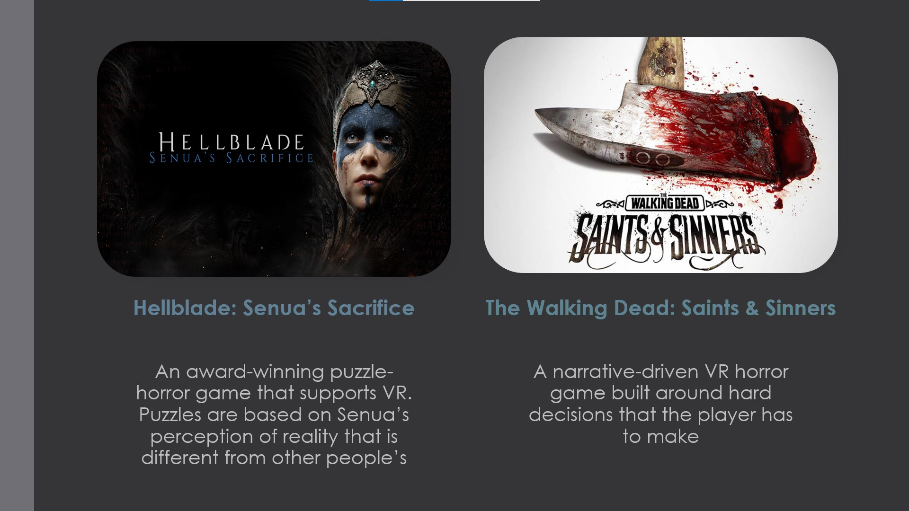

## Advantage Over The Competition
It takes a considerable time investment and a certain headspace to begin playing an AAA game. Sessions tend to only be fun if you have enough time to get completely immersed and absorbed into the experience, not to mention the high price point. AAA games need to be purchased every time one wants a new experience, and the financial investment can quickly add up.

Murder Hotel aims to be the base for a suite of similar, yet different bite sized games that can be purchased at lower price points, individually. Moreover, their short length and single-session play length allow this type of game to fit into a busy schedule much easier that an expensive, heavy AAA game would at a considerably lower price point. PC VR users do presumably have money to spend, but 5 AAA games can easily surpass the price of a headset while not offering much variety.

## Key Metrics
Given the fact that our long-term goal is to create an engaging suite of games based on the same principle, the aspects we should focus on are related to user gain and multiple games purchases.
- Daily new users
- Daily active users (DAU)
- Monthly Active Users (MAU)
- Returning users: users that purchased and played multiple games from us
- Average Session Length: offers insight on the users’ attention span and engagement level

Other metrics, based on a stable audience, are not applicable or relevant for puzzle games with a premium monetization scheme.

## Cost Structure
**Product cost**: hardware (fixed) 

**Service cost**: software licenses (fixed), server maintenance (fixed), art & audio outsourcing (variable, need-based)

**Product line cost**: publisher commissions

**Customer cost**: product returns (variable), physical deluxe editions (fixed)

## Revenue Streams
Transaction-based revenue: the games will be sold premium, at a price point around 15€ in order to keep the commitment of buying another game low and encouraging customers to return to our games repeatedly, while still feeling that their spending is minimal.

# Idea Validation

* Customer Delivery - Overview

In order to gain more insights on what particular features of our product will appeal to our clients and how much will they interact with our game as well, we decided we needed a customer segmentation. We used ***behavioural segmentation*** for this, because of the nature of our product (a game) and because of the fact that the more we predict the purchasing decisions of our customer, the more revenue our project gets.

* Customer Detail - Process

The next step was to conduct the survey, through Google Forms, and the question groups were:

1. Do you own a VR headset?
2. Are you interested in playing a VR game, even if you don't already own a headset?

>Aimed to show us the general interest people have for a VR game.

3. How much do horror games appeal to you?
4. How much do puzzle games appeal to you?

>This goes even deeper into the two genres of the game. We want to see if they are of equal interest to our customers without one overpowering the other.

5. How often do you play video games?
6. And when you are playing, how often is it that you are playing a horror video game?
7. If you answered between 1 to 5 to the previous question, when do you prefer to play horror video games?

>This categorises customers that will interact with our game on set times. We can use this information to market our game during these periods.

8. Which of these features would make your gaming experience unique?

>Segmenting by benefits sought shows us what experience would our customers want more. With that in mind we can push prioritised features first so that our game gains more following at launch.

9. What makes you lose interest in a video game far too early?

>We also need to know the deal breakers for our clients. We want to make sure that people play our game for as long as possible.

10. What makes you invest in a video game?

>This question is meant to reveal the factors that make our undecided clients push that "purchase" button. With that in mind, we can take certain actions, such as deal, knowing that they will bring more profit,

11. How much would you be willing to spend on an indie VR game?
>Straightforward question that will reveal if our price estimation was realistic enough.

12. Is there something else you wish to see in a VR video game?
>Typical open question to make sure that no client input is left unheard.

13. How old are you?
> Although not a behavioural question, this helps us identify age groups and see if responses vary from one to another.

* Customer Detail - Results

Looking over our ***28 responses*** submitted in the past week we can make the following conclusions:

Although not many people own a VR headset, there was an overwhelmingly positive response to wanting to experiment our VR game. As VR headsets are getting more accessible, or easier to borrow, our game will surely get to our customers.

With this question we were trying to verify if both game elements equally appeal to the players, making sure that neither of them retain them from playing the game. As it seems, they are quite balanced.

What we get from this part of the survey is that over 50% of people play video games weekly or even more frequently, but it's not very often that it's a horror game. That means that in our marketing strategy we should highlight that it has two genres, so that it appeals to both horror and non-horror gamers.
Moreover, when people are playing horror games they prefer doing it during the night, to enhance their experience. This leaves room for us to make certain decisions such as events or bonuses during nigh-time.

First to notice is that there is not much of an interest in having a pack of games. That means we will reconsider this after launching the game. Instead, we can focus on having consequences and unique horror through auditory-visual illusions.
There was a positive response to having a self paced game and having little to no instructions, which will definitely set us apart from the competition.

Here, our main concerns with other VR video games align with our customers. This further confirms that our product is desired, and that delivering the features we intend to, will make customers spend more time in our game.

From what it seems, having a Halloween discount and making the game free for a period of time, will surely attract more customers.

The price range selected by more than 50% is our proposed price range or more.

Variations between age groups were very little, which means that our customers act independently of their age.

* Customer Detail - Conclusions

Although some of our initial ideas like having a pack of games or catering the game to a horror audience didn't translate as well as we thought, we were pretty aligned with what our customers want. Knowing what features they want to see more, makes us prioritise certain things for the Customer Validation Stage. We surely know what attracts customers, making our marketing strategy easier.

# Wireframe
The object of the game is to solve a number of puzzles and escape the hotel.

## Level 1 - Attic
The first level is in the attic, where H.H. Holmes has trapped you, the player. After looking around the room, you find an odd looking oil lamp. Looking around some more, a note on the desk suggests using the oil lamp on an basic "hidden text" element, serving as an immersive tutorial on how to use the oil lamp to reveal invisible text. Following the revealed instructions, it becomes clear that you should look for a key hidden in the bookcase. The key unlocks the door and you are now free to roam the hotel.

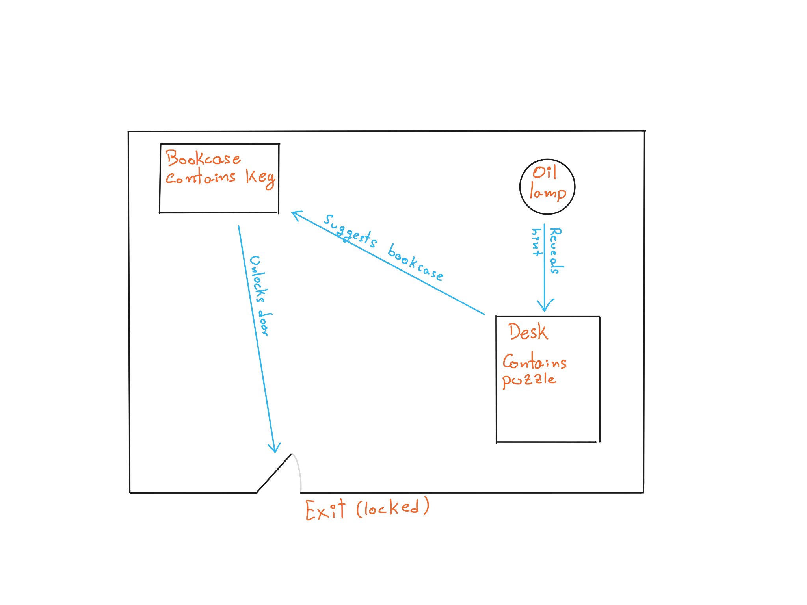
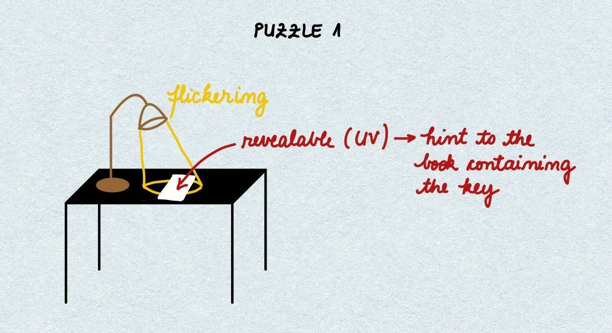

## Level 2 - Hotel
The second level is the main hotel area, spanning two floors. Here, you are supposed to roam around while avoiding Holmes himself who appears in certain areas, either guiding you in the right direction or deterring you from reaching an objective. Holmes' apparitions also serve as a "breadcrumb trail" towards the objective: a photograph containing the puzzle for this level. Looking at the photograph leads you to an identical area in the hotel, except for one difference. Something is missing in the actual room, and investigating it leads you to a trap door, connecting to the basement. 

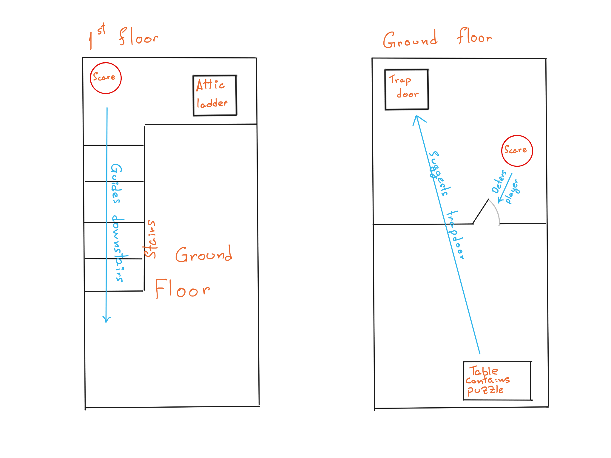
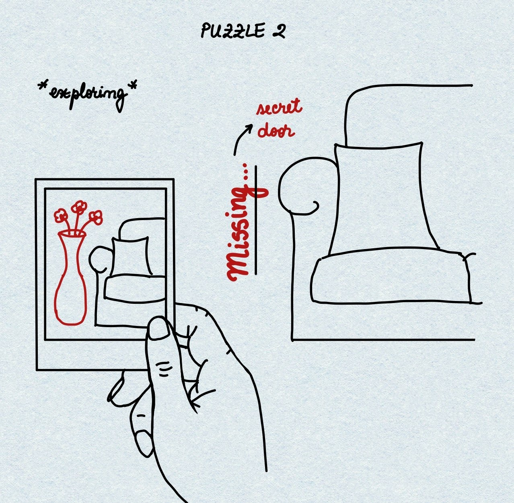

## Level 3 - Basement
The third and last level takes place in the basement. Looking around there is a locked door and it is hinted at that you should look for invisible writing on the wall, using the oil lamp. Once the writing is found, it leads you to a key that unlocks the door. Behind the door, there is another trap door that leads outside. Using it leads to freedom, the game is over!

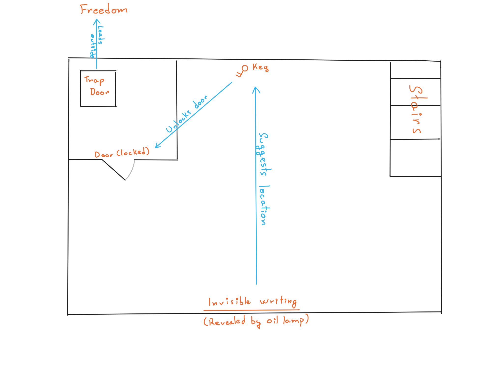
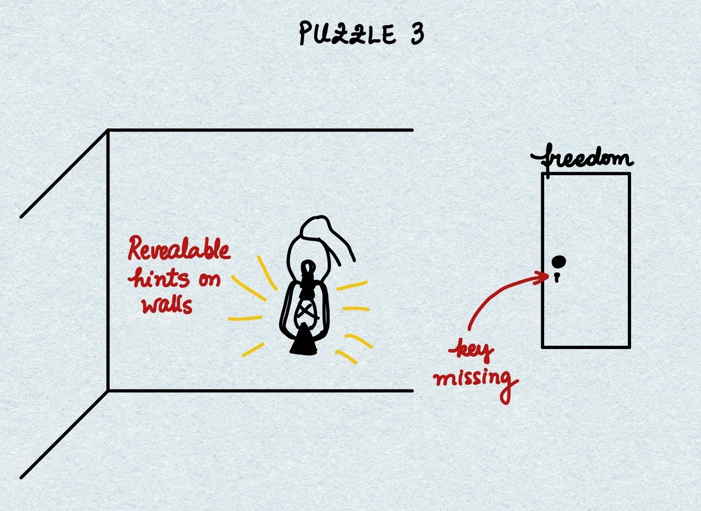

# Landing Page
In terms of our website's landing page, we decided to get help from Adobe XD, because of its easy prototyping and the possibility to export the whole thing to HTML and CSS files or even to a React project using Anima.

##### [Our Adobe XD Landing Page](https://xd.adobe.com/view/c18cd843-cd7c-4ad7-b545-360d96365b5a-94df/)

An XD project usually starts with a defined color palette, for which we chose grey-based colors and a pop of a vibrant red.
The navigation bar contains easy to access information, including links to buying or testing the game.

The main scrollview is composed of 5 components:
* The video ribbon, which contains YouTube videos that act as video presentations for our game and our work.
* The information ribbon, which has a short description of the product.
* The Twitch scrollable ribbon, which shows people currently playing the game, making the product more desirable.
* The deal scrollable ribbon, which is composed of deals, which seem to be the number one determination of purchasing games, according the the survey conducted in M2.
* The footer ribbon.

# Gameplay Loop
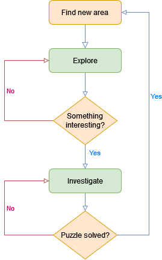

# User Stories
We decided to write the user stories from the perpective of someone in the playable character's shoes in order to help us create a more immersive experience.

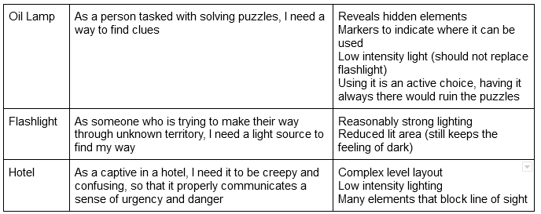

# Persona

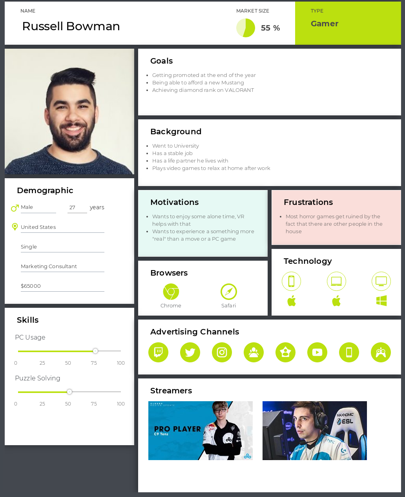

# Interviews

## Luca, 23
Do you own a Steam account?
- Yes.

How many games do you own on Steam?
- About 15.

Do you prefer shorter, low-commitment games or longer, more involved games?
- Mostly prefers shorter games, but did not give a decisive answer. He has a strong preference towards shorter play sessions.

How often do you play video games?
- About twice a week, 2 hours or so at a time.

What games do you currently play?
- Civilization VI, Witch It

When you're playing video games, how often is it a horror game?
- Rarely plays horror games. They are not his main focus, but he did express that a game being part of the horror genre is not necessarily a disadvantage.

What makes you decide if you are going to buy a game full price or wait for a sale?
- An indie game would have to be very good and have a reputation for him to pay 20 euros. 10-15 euros is the range he is willing to spend on an "unproved" indie game. For an AAA or other high budget game, he is only comfortable spending up to 35 euros. Anything above these prices (exceptional situations aside) will be bought on sale). Game length is not a consideration.

Do you ever buy games just because they are on sale?
- Not just because it is on sale, but if a game he was mildly interested in goes on sale, he will likely buy it.

Have you ever played a game in VR? If so, what game(s)?
- Yes, Beat Saber and I Expect You to Die. He enjoyed them both.

Would you be excited to try a bite-sized puzzle-horror game in VR?
- Yes, the puzzle aspect is more exciting to Luca than the horror aspect, and the game being short is a good fit for his busy schedule at the office. The answer mostly depends on puzzle quality.

## Dan, 25
Do you own a Steam account?
- Yes.

How many games do you own on Steam?
- About 18.

Do you prefer shorter, low-commitment games or longer, more involved games?
- Prefers high commitment games and regularly plays MMORPGs, but will often take a break to play a shorter game.

How often do you play video games?
- Quite often, pretty much every day.

What games do you currently play?
- World of Warcraft, Guilty Gear Strive, Phasmophobia

When you're playing video games, how often is it a horror game?
- Very often, most of the shorter games he plays between raids are horror games.

What makes you decide if you are going to buy a game full price or wait for a sale?
- He generally buys indie games full price, but never spends the full price on AAA games.

Do you ever buy games just because they are on sale?
- Yes, mostly because a friend tells him about them, and he buys the game in order to play together.

Have you ever played a game in VR? If so, what game(s)?
- Yes, Beat Saber, Ping Pong and Phasmophobia.

Would you be excited to try a bite-sized puzzle-horror game in VR?
- Yes, it would be great as something to play while taking a break from World of Warcraft, and it's a horror game as a bonus.

## Ilaria, 22
Do you own a Steam account?
- Yes

How many games do you own on Steam?
- 23

Do you prefer shorter, low-commitment games or longer, more involved games?
- It depends on how much free time she has. When she's busy, she will almost exclusively play short, bite-sized games, but will gladly start one requiring a significant time investment during summer vacation.

How often do you play video games?
- About twice a week, mostly late at night.

What games do you currently play?
- Phasmophobia, Online board games.

When you're playing video games, how often is it a horror game?
- Almost every time, her favourite game is Phasmophobia.

What makes you decide if you are going to buy a game full price or wait for a sale?
- For an indie game, she usually pays full price up to 20 euros, and for a large-budget game a price over 40 euros will make her wait for a sale.

Do you ever buy games just because they are on sale?
- Only if they were already wishlisted and the sale is substantial.

Have you ever played a game in VR? If so, what game(s)?
- Yes, Phasmophobia.

Would you be excited to try a bite-sized puzzle-horror game in VR?
- Definitely, anything that reminds her of Phasmophobia is welcome.

## Interview Conclusions
Overall, it looks like the idea of a horror game appeals to our target audience. Those who are not specifically interested in horror are still tempted by the puzzle aspect, and all the people we asked like short games, at least casually if not as their main focus. The price range we projected (about 15 euros) seems to be in the sweet spot of what people would buy at full price, and small sales will likely be enough to convince anyone who is on the fence about our product. The platform we chose seems to be welcome, since everyone we asked already uses Steam regularly.

The interviews made it clear that even if many people are interested in Murder Hotel and wishlist it, they might still need an extra incentive to buy the game. With this in mind, we will look into the idea of pricing Murder Hotel slightly above 15 euros, and implementing occasional sales, bringing the price down to what we originally thought to be a good starting point.

Moreover, our interviewees have all tried VR games, but one of them does not actually own a headset, meaning that even if they would normally buy Murder Hotel, the hardware investment would be too much to expect as an indie developer. This lead us to believe that implementing a standard PC mode could be the way to go, while still keeping VR mode as the main focus. This two-mode architecture is similar to what Phasmophobia achieved.

Another thing that became apparent is that we need people to recommend the game to their friends. Advertising is, of course, necessary, but what will actually convince people to buy our game is if their friends played and enjoyed it in the past. We believe that this is a good sign for our "suite of games" concept, since we benefit from the excitement generated by each new release, attracting more and more friends of those who enjoyed previous installments in the series. Our questionnaire showed that there is not much interest in game bundles, so releasing and selling these games individually is likely best.

Since the bite-size length and play sessions appealed to everyone, we think that this should be a main focus. Similar to childrens' TV shows, we want to make sure that play sessions are self explanatory and enjoyable even if the user has not played in a long time and doesn't remember much. This way, it will never feel like a hassle or an annoyance to "just play for a bit", further leaning on the casual audience: busy people who don't have a lot of time for games and heavy gamers who want a bit of diversity.

# Lead Generation and Collection

## Newsletter

## Backstory

Since our landing page is prototyped in XD, we needed a plugin that lets us test it. For that we used **Useberry**, which captures user insights by asking them to perform quick tests on our design prototype. The tasks that were given were:

1. **The 5 sec test**: Look at the landing page for 5 sec and write the first thing you noticed.
2. Sort the cards in the order you noticed them(the purchase button, the video previews, the game screenshot the logo of the game, the free trial, the upper menu, other elements (promotions etc.)
3. **First Click**: Where would you click to purchase our product?
4. **First Click**: Where would you click to access our Halloween sale?
5. **First Click**: How about subscribing to our newsletter?
6. **First Click**: What about viewing our other games?
7. **First Click**: Can you also click on one Twitch video?
8. **Yes/No**: Was your overall experience with our landing page good?

## Results

1. The 5 sec test

2. Sort the cards in order

3. First Click

4. First Click

5. First Click

6. First Click

7. First Click

8. Yes/No

## Test Conclusions 

The test results were overall great. From our limited 10 testers, we can make the following conclusions:

1. The first thing that catches your eyes when looking at our landing page is either the logo or the video header. That is good as customers know exactly what the game is about.
2. When it comes to card sorting, the way our testers ordered them follows the flow we want our customers to digest information about our product.
3. All users clicked on either trying or buying the game, no other misclicks.
4. Some people were stuck in the upper portion of the page, but most of them found the Halloween sale.
5. Most users interacted with our Newsletter ribbon.
6. Most of them were right to go in the Games section in the header.
7. Here there was a little confusion between our video presentations and our Twitch ribbon. **Marking the video presentations as our content can help the confusion**.
8. 90% of our testers had a good experience with the landing page.
