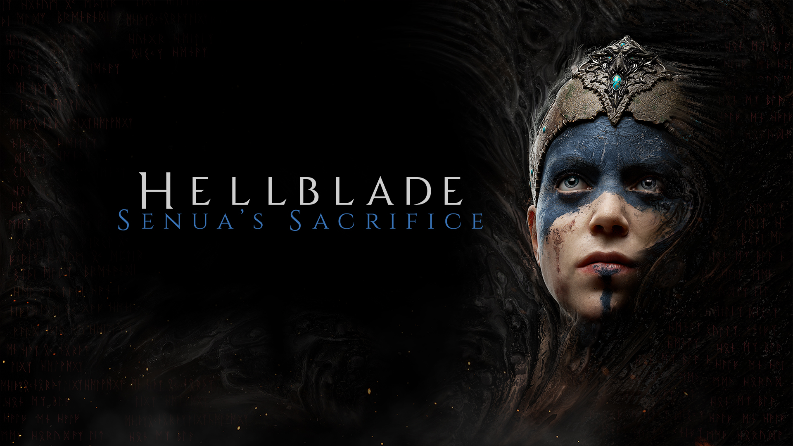
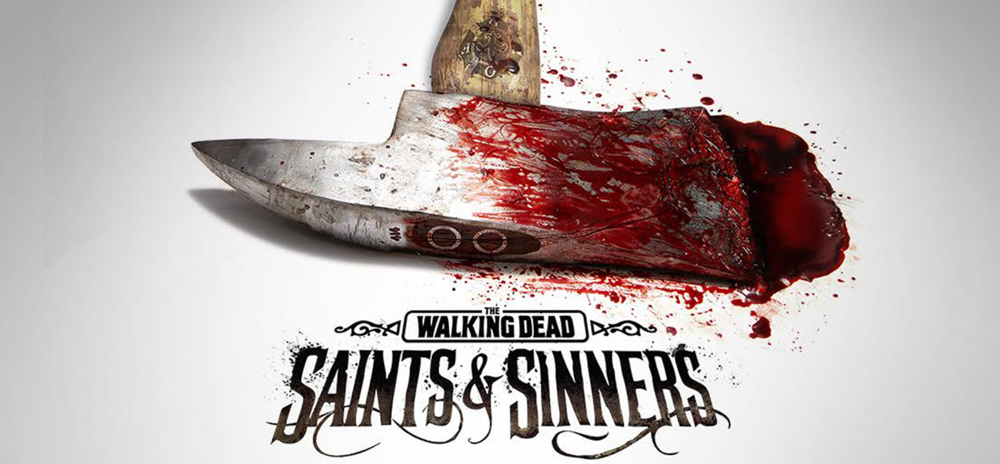

## The Team

**Mara Chirascu** - Marketing Researcher, Lead Game Designer

**Lavinia Loghin** - Public Facing Services, Software Engineer

**Chris Luntraru** - Tech Lead, Game Designer

## The Problem
Video games are starting to feel stale nowadays. There can be no doubt that the entertainment industry could always benefit from innovative ideas and new twists on classic designs. We believe that the genre that benefits the most from virtual reality is horror. The extra immersion gained from a complete field of view serves to communicate fear and tension in a much more visceral way.

## Value Proposition
By choosing to play our games, you have the get to experience a whole new reality. You move past the limits of the plastic frames around your screen and have the opportunity to truly interact with your environment and experience a character's story first-hand.

## Customer Segments
We target a niche-market customer segment. Our customers are people who regularly play and enjoy either puzzle games, horror games or both and feel the need to elevate their experience. Moreover, those we target need to own a VR headset and a PC capable of running VR games. These restrictions mean that they are willing to spend a notable amount of money on their hobby, a fact that can be taken into consideration when developing a business model.

## Competition

**Hellblade: Senua's Sacrifice** - An award winning puzzle-horror game that supports VR. Puzzles are based on Senua's perception of reality that is different from other people's.

**The Walking Dead: Saints & Sinners** - A narrative-driven VR horror game built around hard decisions that the player has to make.

## Advantage Over The Competition
It takes a considerable time investment and a certain headspace to begin playing and enjoy an AAA game. Sessions tend to only be fun if you have enough time to get completely immersed and absorbed into the experience, not to mention the high price point. AAA games need to be purchased every time one wants a new experience, and the financial investment can quickly add up.

Murder Hotel aims to be the base for a suite of similar, yet different bite sized games that can be purchased at lower price points, individually. Moreover, their short length and single-session play length allow this type of game to fit into a busy schedule much easier that an expensive, heavy AAA game would at a considerably lower price point. PC VR users do presumably have money to spend, but 5 AAA games can easily surpass the price of a headset while not offering much variety.

## Key Metrics
Given the fact that our long-term goal is to create an engaging suite of games based on the same principle, the aspects we should focus on are related to user gain and multiple games purchases. 
- Daily new users
- Daily active users (DAU)
- Monthly Active Users (MAU)
- Returning users: users that purchased and played multiple games from us
- Average Session Length: offers insight on the users’ attention span and engagement level

Other metrics, based on a stable audience, are not applicable or relevant for puzzle games with a premium monetization scheme.

## Cost Structure
**Product cost**: hardware (fixed)

**Service cost**: software licenses (fixed), server maintenance (fixed), art & audio outsourcing (variable, need-based)

**Product line cost**: publisher commissions

**Customer cost**: product returns (variable), physical deluxe editions (fixed)

## Revenue Streams
Transaction-based revenue: the games will be sold premium, at a price point around 15€ in order to keep the "risk" of buying another game low and encouraging customers to return to our games repeatedly, while still feeling that their spending is minimal.

